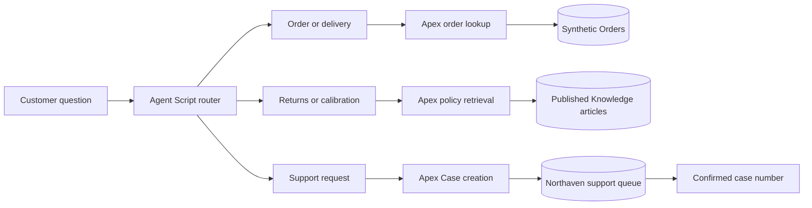

# From a support reply to a Salesforce record

Northaven Instruments is a fictional lab-supplies shop. This build uses synthetic orders and
policies to test a small service workflow: answer an order question, retrieve a policy, or save a
request for someone to review. The public page presents recorded runs, not an open customer channel.

## The path through the agent

Each action has an explicit input/output contract. The order action returns details only when the
supplied reference and email match. The policy action returns an Online article, its title and id.
The support action returns success only after a Case exists; the answer includes that Case Number.
The public examples show both the reply and the record or retrieval evidence behind it.

## The failure that shaped it

In the first preview, the user running the agent lacked access to the Apex lookup. The action was
absent from the available tools. The agent still said it was checking the order. Assigning the
permission restored the tool and the query. The original transcript is retained in
`capture/23-first-conversation.md`.

That made action-level checks a requirement. A pleasant reply is not sufficient evidence that an
operation ran. The early escalation test had a similar gap: entering a preview “human” node did
not establish that a support team received the request. This version uses an asynchronous Case
with a known queue instead. It does not claim a live chat transfer.

## Permissions and failure behaviour

The agent runs as an Einstein Agent User with a dedicated permission set. The operator and agent
are members of the demo queue. Queue email notifications are off. No external customer receives
anything from this demonstration.

An unavailable queue, invalid contact details or an unconfirmed write must return an explicit
failure. A repeated identical request on the same UTC date reuses its Case; a unique field prevents
a racing duplicate insert. This is a bounded demo retry rule, not a general conversation identity
system. A production integration should use a trusted session/request key.

The policy action reads three specific Knowledge articles by topic. It is a small, inspectable
retrieval path, not a test of vector search or Salesforce's full Knowledge recommendation stack.
A draft article must not be returned as published policy. The unit tests check that distinction.

## Measurement and scope

The acceptance report links the activated version, test prompts, transcripts, execution evidence
and queried Case records. The original development rounds remain available with their later
corrections. Cases reused during tuning are labelled as such; fresh cases are identified separately.
Code coverage is a diagnostic, not a claim of production readiness.

Email/reference matching is not authentication. A customer deployment would need an identity and
access design, a real communications channel, staffing, notification and retention decisions,
monitoring, adversarial tests and cost measurement. Those requirements do not disappear because
the synthetic demonstration works.

[Operator handover](HANDOVER.md) · [Source](https://github.com/Benji-cpu/agentforce-in-the-open)
